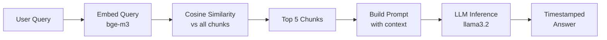

# 🤖 RAG-Based AI — Video Course Assistant

A **Retrieval-Augmented Generation (RAG)** pipeline that lets users ask natural language questions about a video course and get precise, timestamped answers pointing to the exact video and moment where a topic is taught.

Built as a local-first system using **Ollama** for embeddings & LLM inference and **OpenAI Whisper** for speech-to-text transcription.

---

## 📌 Overview

This project processes YouTube course videos (currently the **Sigma Web Development Course**) through a multi-stage pipeline:

1. **Audio Extraction** — Video files are converted to MP3 audio.
2. **Speech-to-Text** — Audio is transcribed and translated using OpenAI Whisper, producing timestamped subtitle chunks.
3. **Chunking** — Transcriptions are split into meaningful chunks stored as JSON files with metadata (title, video number, start/end timestamps, text).
4. **Embedding Generation** — Each chunk is embedded using the `bge-m3` model via Ollama, then stored in a serialized DataFrame (`embeddings.joblib`).
5. **Query & Retrieval** — User queries are embedded, compared via cosine similarity against all chunks, and the top-k results are passed as context to an LLM (`llama3.2`) to generate a human-readable, timestamped answer.

---

## 🏗️ Architecture

```
┌──────────────┐     ┌──────────────┐     ┌──────────────────┐
│  Video Files │────▶│  MP3 Audios  │────▶│  Whisper (STT)   │
│  (YouTube)   │     │  /audios/    │     │  stt.py          │
└──────────────┘     └──────────────┘     └────────┬─────────┘
                                                   │
                                                   ▼
                                          ┌──────────────────┐
                                          │  JSON Chunks     │
                                          │  /jsons/         │
                                          └────────┬─────────┘
                                                   │
                                                   ▼
                                          ┌──────────────────┐
                                          │  Embeddings      │
                                          │  (bge-m3 model)  │
                                          │  3_read_chunks.py│
                                          └────────┬─────────┘
                                                   │
                                                   ▼
                                          ┌──────────────────┐
                                          │  embeddings      │
                                          │  .joblib         │
                                          └────────┬─────────┘
                                                   │
                         User Query ──────────────▶│
                                                   ▼
                                          ┌──────────────────┐
                                          │  Cosine          │
                                          │  Similarity +    │
                                          │  LLM Inference   │
                                          │  (llama3.2)      │
                                          │ process_incoming │
                                          └────────┬─────────┘
                                                   │
                                                   ▼
                                          ┌──────────────────┐
                                          │  Timestamped     │
                                          │  Answer          │
                                          └──────────────────┘
```

---

## 📂 Project Structure

```
Rag_Based_AI/
│
├── audios/                          # MP3 audio files extracted from course videos
├── jsons/                           # Timestamped subtitle chunks (JSON per video)
├── Videos/                          # Raw video/audio source files
│
├── stt.py                           # Speech-to-Text using OpenAI Whisper
├── create_chunks.ipynb              # Jupyter notebook — transcription & chunking pipeline
├── create_chunks_2.ipynb            # Jupyter notebook — alternate chunking approach
├── 3_read_chunks.py                 # Generate embeddings from JSON chunks → embeddings.joblib
├── process_incoming.py              # Main query pipeline — embed query, retrieve, LLM answer
├── process_video.py                 # Utility to parse video filenames & extract metadata
├── rename_mp3.py                    # Batch rename MP3 files with sequential numbering
├── example_read_chunks.py           # Minimal example of Ollama embedding API usage
│
├── embeddings.joblib                # Serialized DataFrame with chunk texts + embeddings
├── prompt.txt                       # Last generated LLM prompt (for debugging)
├── response.txt                     # Last generated LLM response (for debugging)
└── README.md                        # You are here
```

---

## ⚙️ Tech Stack

| Component          | Technology                                                     |
| ------------------- | -------------------------------------------------------------- |
| **LLM Inference**   | [Ollama](https://ollama.com/) — `llama3.2`                     |
| **Embeddings**      | [Ollama](https://ollama.com/) — `bge-m3`                       |
| **Speech-to-Text**  | [OpenAI Whisper](https://github.com/openai/whisper) — `base`   |
| **Similarity**      | Cosine Similarity via `scikit-learn`                            |
| **Data Handling**   | `pandas`, `numpy`, `joblib`                                     |
| **Language**        | Python 3.x                                                      |

---

## 🚀 Getting Started

### Prerequisites

- **Python 3.8+**
- **[Ollama](https://ollama.com/)** installed and running locally
- Required Ollama models pulled:
  ```bash
  ollama pull bge-m3
  ollama pull llama3.2
  ```

### Installation

1. **Clone the repository**
   ```bash
   git clone https://github.com/Ayush-Das-9/Rag_Based_AI.git
   cd Rag_Based_AI
   ```

2. **Install Python dependencies**
   ```bash
   pip install pandas numpy scikit-learn joblib requests openai-whisper
   ```

3. **Start Ollama** (if not already running)
   ```bash
   ollama serve
   ```

---

## 📖 Usage

### Step 1 — Transcribe Videos (if starting from scratch)

Place your course video MP3 files in the `audios/` directory, then run:

```bash
python stt.py
```

Or use the Jupyter notebooks (`create_chunks.ipynb` / `create_chunks_2.ipynb`) for the full transcription and chunking pipeline. This generates JSON files in `jsons/`.

### Step 2 — Generate Embeddings

```bash
python 3_read_chunks.py
```

This reads all JSON chunk files, generates embeddings via Ollama's `bge-m3` model, and saves the result to `embeddings.joblib`.

### Step 3 — Ask Questions

```bash
python process_incoming.py
```

You'll be prompted to type a question. The system will:
1. Embed your question
2. Find the top 5 most similar chunks via cosine similarity
3. Pass them as context to `llama3.2`
4. Return a human-readable answer with video references and timestamps

**Example:**

```
Ask a Question: where is flexbox taught?

→ You can find the content related to Flexbox in Video 13 of our course.
  Specifically, it's at around 331 seconds into that video where we dive
  into the world of Flexbox and Grid...
```

---

## 📊 How It Works



1. **Embedding** — The user's question is converted to a vector using `bge-m3`.
2. **Retrieval** — Cosine similarity is computed against all pre-computed chunk embeddings.
3. **Augmented Generation** — The top-5 most relevant chunks (with video title, number, timestamps, and text) are injected into a prompt template.
4. **Response** — The LLM generates a conversational answer directing the user to the specific video and timestamp.

---

## 🗃️ Data Format

Each JSON file in `jsons/` follows this structure:

```json
{
  "chunks": [
    {
      "title": "Your First HTML Website  Sigma Web Development Course",
      "number": "1",
      "start": 0.0,
      "end": 5.2,
      "text": "Welcome to the Sigma web development course..."
    }
  ]
}
```

---

## 🔮 Future Scope

- 🎙️ **Voice Input** — Accept spoken questions via Whisper for a fully voice-driven experience
- 🌐 **Web Interface** — Build a frontend for interactive querying
- 📚 **Multi-Course Support** — Extend to multiple courses and playlists
- 🔄 **Streaming Responses** — Enable real-time streamed LLM outputs
- 🧠 **Advanced Chunking** — Implement semantic chunking for better retrieval accuracy

---
